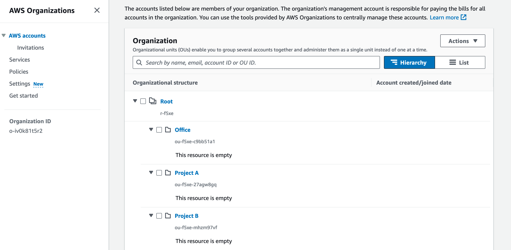

# AWS Organizations & IAM

## IAM Groups
Instead of managing every individual user, create user groups and attach users to groups. You can manage a large amount of users by just managing groups.

### Pro
- Users can be in multiple groups.
- Groups can only contain users, not other groups.
- AWS you apply least privilege principle, don´t give more permissions than needed.
- Create your users globally not in a region that the groups are available everywhere.
- Add a admin user in the account what was created, don´t use the root account to create all on top of it, create admin, group name should be admin.
- Attach multiple IAM Policies to the group.

You can attach specific IAM Policies for each user group (IAM Groups), of course the admin group needs different policies as the developers group.

---
 

## IAM Policies

### Pro
- With policies one can add specific permissions for a group, also for specific users but this is not best practice, always manage users within IAM Groups.
- Write your own policies, create policies via creator or use one of the hundreds of AWS pre created policies.

Example policy.

---
 

## IAM Roles
An AWS service role is an AWS Identity and Access Management (IAM) role that grants permissions to AWS services to access resources on your behalf and perform specific actions as part of service operations.

You can attach roles to the following services:
- EC2 Instances
- Lambda
- RDS
- Redshift
- S3
- EMR
- ECS
- Glue
- Kinesis Streams
- SQS
- SageMaker
- Step Functions

---
 

## IAM Security

Add password policy for users and require following:
- upper and lowercase letters
- numbers
- non-alphanumeric characters
- Allow all IAM users to change their password
- Require users to change their passwords all 90 days for example, expiration
- Prevent password re-use

Require MFA - Multi-Factor-Authentication for users:
- Google Authenticator
- Authy
- YubiKey
- Hardware Key Fob
- Hardware Key Fob AWS CovCloud US

Additional:
- Use access keys for programmatic access

---
 

## IAM Boundaries

- Restrict individual users or services.
- Overwrite attached policies with boundary policies for example you can restrict an admin to no permission although the admin policy is still set. 

---
 

## Control Tower - AWS Control Tower
AWS Control Tower is useful for organizations that need to manage multiple AWS accounts, enforce security and compliance standards, and establish a well-architected environment with streamlined provisioning and governance processes. It's particularly beneficial for enterprises, large-scale applications, and organizations with complex cloud deployments that want to ensure a secure, efficient, and standardized approach to managing their AWS resources.

--
 

## IAM Identity Center- AWS IAM Identity Center
Single-Sign-On service in AWS.

### Pro
- Single-Sign-On for all AWS accounts, business cloud applications, SAML2.0 enabled applications, EC2 Windows Instances
- Active Directory (AD) , OneLogin, Okta included.
- Define which user has the permission to access what.
- SAML2.0 enables applications: NextCloud, Wordpress, Jenkins, Keycloak, DokuWiki and a lot more.

---
 

## AWS Organization

### Pro
- Global service, allows to manage multiple AWS accounts.
- Consolidated billing across all accounts.
- Shared reserved instances and saving plans discount across accounts.
- You can create OU (Organization Units) to organize and create account hierarchy.

Here you can see a hierarchy of accounts. For example, in Project A could be a "project_a_prod" for production account and "project_a_dev" for development account.

This freaky diagram explain you the process, users -> IAM Groups -> Organization -> Hierarchy OU -> Projects -> users are attached to.

---
 

## Solution Architect Summary 😍

- <b>IAM Groups: </b>Create IAM Groups like admin, developers, security etc. and attach users to the specific groups. Manage users within IAM Groups. Grant groups access only to necessary AWS services, achieve this with policies. 

- <b>IAM Policies: </b> Create policies and attach them to IAM Groups or to any services.

- <b>IAM Roles: </b>Attach roles to AWS services, for example to grant EC2 Instance to write or read from S3 bucket, to do so you have to attach role to S3.

- <b>IAM Boundaries: </b>Use IAM Boundaries when you wanna limiting permissions for third-party services, implementing the principle of least privilege, enforcing separation of duties, and controlling access to sensitive resources.

- <b>Control Tower: </b>Use AWS Control Tower in case you have a Organization to simplify and automate the process of setting up and governing a secure and well-architected multi-account AWS environment. Make use of pre-configured best practices and guardrails. A Control Tower landing zone serves as a starting point for creating a well-architected, multi-account AWS environment.

- <b>IAM Identity Center: </b>Use AWS IAM Identity Center when you want to use Single-Sign-On for many business services. Employees can access various business applications with one sign in.

- <b>AWS Organization: </b>Use AWS Organizations when you need to efficiently manage multiple AWS accounts, establish a hierarchy for account organization, enforce policies consistently, and streamline billing and cost allocation within your organization.

- <b>AWS SCP: </b>AWS SCP (Service Control Policies) is a feature within AWS Organizations that enables central administrators to manage permissions and access control across multiple AWS accounts in a hierarchy. SCPs are used to define fine-grained permissions and restrictions on services and actions that can be performed within member accounts, helping enforce compliance and security policies across an organization's AWS environment.

- <b>AWS Organization Consideration: </b>Be aware that the AWS Organization has mega power over all because a lot of policies are managed over accounts in the organization, it is possible that the organization creator can shut down or delete every service in all accounts of different projects in minutes.

- <b>AWS Organization Consideration 2: </b>If a situation arises where the owner of an AWS Organization account passes away, it's important for the organization to have clear procedures in place for managing account ownership, access, and any associated resources. This might involve coordination with legal and administrative teams to ensure proper handling of the account and its assets according to your organization's policies.