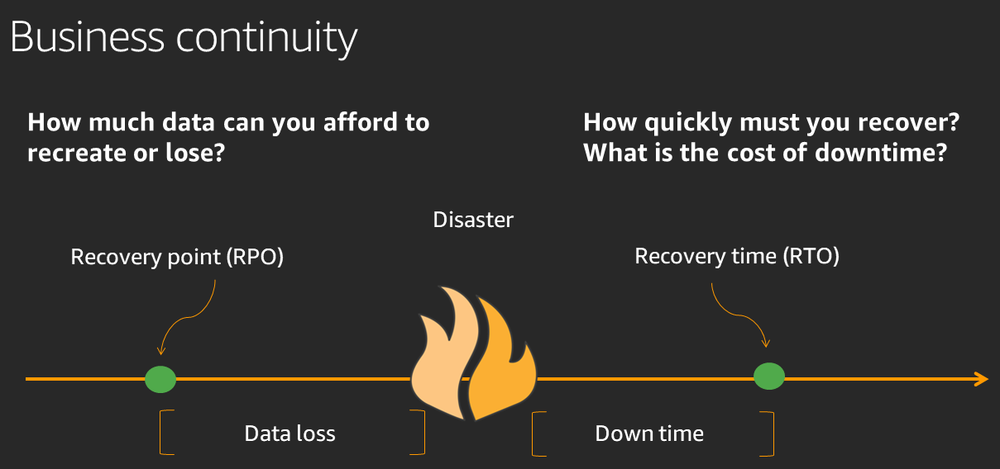
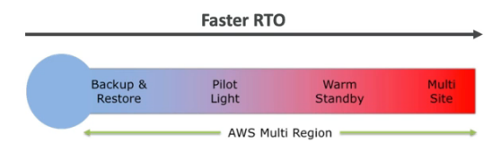
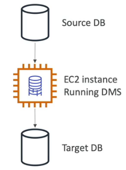
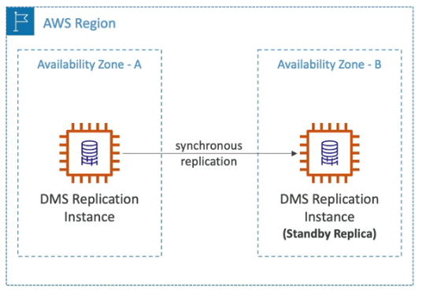
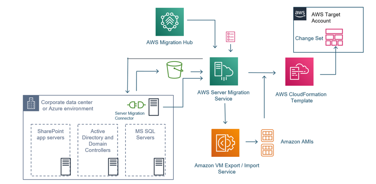

# AWS Data Migration & Disaster Recovery

## Disaster Recovery
Disaster Recovery focuses on one-time recovery objectives in response to natural disasters, large-scale technical failures, or human threats such as attack or error.
### Hybrid Disaster Recovery
on-premises -> AWS Cloud / Backup etc.

### AWS Cloud Disaster Recovery
Multi region and multi AZ architectures.

---

The smaller you keep the downtime (architecture) the higher it will cost.

### RPO - Recovery Point Objective
Defined by the organization. RPO is the maximum acceptable amount of time since the last data recovery point. This determines what is considered an acceptable loss of data between the last recovery point and the interruption of service.

### RTO - Recovery Time Objective
Defined by the organization. RTO is the maximum acceptable delay between the interruption of service and restoration of service. This determines what is considered an acceptable time window when service is unavailable.

---

### Disaster Recovery Strategies
1. Backup and Restore  
   Backup on-premises data into S3 or S3 Glacier.

2. Pilot Light 
   Small version of the app is always running in the cloud. Only for critical systems which need fast recovery.

3. Warm Standby 
   Full system is up and running with minimum size. Very low RTO, recovery in seconds. Very EXPENSIVE - for very critical architectures for example hospital applications. In a warm standby strategy, a secondary environment is kept ready and operational, but it's not actively processing live traffic.

4. Multi Site 
   Multi-site disaster recovery involves replicating your entire environment, including data and infrastructure, across geographically separated locations. active-active.

The warmer the more expensive.

---
 

## DMS - Database Migration Service
A small quick secure migrate database which running on EC2.

### Requirements
- Create an EC2 Instance and the EC2 Instance will make the migration when you use the common way and not Snow Family to migrate.
- Possible from for example on-premises Postgres -> AWS RDS Postgres
- Possible from for example on-premises Postgres -> Aurora  /cross
- Useable for multi AZ architectures.

DMS multi AZ replication example.

---

### Sources
- Oracle
- MS SQL Server
- MySql
- MariaDB
- Postgres
- MongoDB
- SAP
- DB2
- Azure SQL Database
- RDS including Aurora
- S3
- DocumentDB

### Targets
- Oracle
- MS SQL Server
- MySql
- MariaDB
- Postgres
- MongoDB
- SAP
- RDS
- Redshift
- DynamoDB
- S3
- OpenSearch
- Kinesis Data Stream
- Apache Kafka
- DocumentDB
- Neptune
- Redis

---
 

## SCT - AWS Schema Conversion Tool
If the source database has an different engine as the target database we need to convert the database to the right engine. For example a Oracle -> Redshift

### Pro
- Schema Conversion Tool working as a middleware to convert database and load it to the target.
- Dont´t need to use if it is the same database engine for example on-premises Postgres -> AWS RDS Postgres.

---
 

## AWS Backup
Centrally manage and automate backups within AWS Cloud.
### Pro
- Support for all databases and EFS, FSx, Storage Gateway.
- Cross region backup.
- Cross account backup.
- Scheduled backups.
- PITR support.
- Backup policies, backup plans, also to cold storage etc.

---
 

## MGN - AWS Application Migration Service

### Pro
- Lift and shift (rehost) solution which simplify migration applications to AWS.
- Converts your physical, virtual and cloud based servers to run natively in the cloud.
-  When you’re ready, it automatically converts and launches your servers on AWS.

---
 

## VMware Cloud on AWS
### Pro
- Migrate VMware vSphere based workloads to AWS
- Run production environment hybrid between on-premises and AWS Cloud.
- Disaster recovery strategy.

---
 

## Solution Architect Summary 😍

- <b>DMS: </b>Use Database Migration Service to migrate databases from on-premises to AWS Cloud but you can also use DMS within AWS Cloud to migrate as well or to synchronous database replication in multi AZ.

- <b>SCT: </b>Use AWS Schema Conversion Tool as a middleware when you wanna migrate databases with different engines for example MySql -> Aurora.

- <b>AWS Cloud Disaster Recovery: </b>Integrate it in your architecture from the beginning.

- <b>AWS Migration Hub: </b>AWS Migration Hub provides a single location to track migration tasks across multiple AWS tools and partner solutions. You can choose the AWS and partner migration tools that best fit your needs while providing visibility into the status of your migration projects. Migration Hub also provides key metrics and progress information for individual applications, regardless of which tools are used to migrate them.

- <b>AWS Backup: </b>Use AWS Backup to manage, plan and automate backups within AWS Cloud in one place. For all databases and EFS, FSx, Storage Gateway.

- <b>AWS Backup Vault Lock: </b>Use AWS Backup Vault Lock when you want to create a backup which cant be deleted. Even the root user cannot delete backups when this is enabled. Use MFA to disable this.

- <b>AWS Application Discovery Service: </b>Use Application Discovery Service when you wanna migrate on-premises application -> AWS Cloud. Discover Service will gather information about your data center (config, dependencies, mapping etc.) to help you to migrate application to AWS seamlessly.

- <b>MGN: </b>Use AWS Application Migration Service when you wanna shift and lift on-premises applications to AWS Cloud.

- <b>Snow Family: </b>Use one of the services of Snow Family to migrate extra large amount of data to AWS Cloud. When your migration takes longer than 1 week over the internet just take Snowball for example to migrate. For more information about Snow Family go ti StorageGateway_Transfer.

- <b>VMware Cloud on AWS: </b>Use VMware Cloud on AWS when you wanna run your on-premises VMware hybrid with AWS Cloud for disaster recovery strategy or migrate in to AWS.
