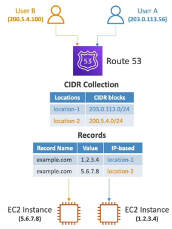

# AWS LoadBalancer & Route53 & Global Accelerator

The reason why I wrote down the description for LoadBalancers, Route53, AutoScaling and GlobalAccelerator in one is that people inclusive me were confused while learning these services completely separated to each other.
  
You have to understand the differences that you can architect different architectures based on your requirements.
 

With Application Load Balancers, Network Load Balancers, and Gateway Load Balancers, you register targets in target groups, and route traffic to the target groups

 

**Note:** I will not go to deep into these services, this is for understanding.

**Note:** Elastic Load Balancer ELB is a high level word for Application Load Balancer ALP, Network Load Balancer NLB and Gateway LOad Balancer.

___
 

## ALP Application Load Balancer
Load Balancer on application level.

ALP works with health checks to your applications. In connection with a AutoScaling Group it is possible to scale up and down based on your utilization. 

### Pro
- Load balancing to multiple HTTP applications across machines (target groups).
- Load balancing to multiple applications on the same machine (containers).
- Layer 7 (HTTP/HTTPS traffic), flexible.
- It is also possible to have a load balancer to on-premises servers or hybrid.
- ALP can be connected with AutoScalingGroup.
- Possibility to set SSL/TSL Certificate.
- Cross zone load balancing is best practice for a ALB. It is required to have atleast two AZ.
- Round Robin algorithm to route traffic. 
- IP addresses are dynamic.
- Possibility to use WAF - AWS Web Application Firewall.

### Examples

In this example you can see EC2 Instances, but it also works with container microservices.

 

In this example without AutoScaling, ALB has created so called nodes for every AZ and Route53 routes to the ALB. Cross-Zone Load Balancing must be enabled.

---
 

## NLB Network Load Balancer

### Pro
- Layer 4 (TLS/TCP/UDP traffic), static IPs.
- For TCP/UDP targets.
- Can be used with PrivateLink due to static IPs.
- Possibility to set SSL/TSL Certificate.

### Contra
- WAF - AWS Web Application Firewall cannot be used because WAf in on Layer 7 HTTP.

___
 

## Gateway Load Balancer GWLB
Gateway Load Balancer is for high security architecture. It provides a single point to enter and exit. Your traffic will be routed to firewalls before the application receiving the request. 

## Pro
- Layer 3 (Network Layer) IP packets - only private IPs.
- High security.
- Possibility to set SSL/TSL Certificate.
- Singe entry and exit point for all traffic.
- GENEVE protocol on port 6081.
- GWLB can be connected with AutoScalingGroup.
- Cross load balancing possible to enable, best practice.

---
 

## ALB vs NLB

- ALB and NLB working on different levels.
- While the Application Load Balancer(ALB) looks at the HTTP request header to determine where to route the request, the Network Load Balancer(NLB) simply forwards requests.
- Also Application Load Balancer can guarantee application availability, however Network Load Balancer cannot.
- No WAF possible.

---
 

## ALB + NLB

- You can use PrivateLink only with NLB in front of ALB, due to NLB´s static IP.
- If you have hybrid solution like HTTP and TCP you can use both ALB and NLB.
- Both can be used with AutoScalingGroup.

### Pro
- Layer 4/7 (HTTP/TCP/SSL traffic), legacy, avoid.

---
 

## Route53
Amazon Route 53 is a highly available and scalable Domain Name System (DNS) web service.
For understanding, Route53 is the layer above the Load Balancers, but it is more than that, let me explain.

### Pro
- Domain name registration.
- For multi region architectures.

### Methods of routing
- <b>Simple routing policy</b> — Use for a single resource that performs a given function for your domain, for example, a web server that serves content for the example.com website. No Health Checks possible.

- <b>Weighted routing policy</b> — Use to route traffic to multiple resources in proportions that you specify. Define how much traffic specific resources should get, for example 30% of traffic for resource A and 70% for B.

- <b>Latency routing policy</b> — Use when you have resources in multiple AWS Regions and you want to route traffic to the region that provides the best latency, the shortest way to the next server from user perspective. For example, when there are latencies of 50ms and 400ms it will automatically take 50ms to the lowest latency.

- <b>Failover routing policy</b> — Use when you want to configure active-passive failover. Combined with Heath Checks. If one service is unhealthy, Route53 failover policy will automatically failover to the healthy service.

- <b>Geolocation routing policy</b> — Use when you want to route traffic based on the location of your users.

- <b>Geoproximity routing policy</b> — Use when you want to route traffic based on the location of your resources and, optionally, shift traffic from resources in one location to resources in another.

- <b>Multivalue answer routing policy</b> — Use when you want Route 53 to respond to DNS queries with up to eight healthy records selected at random. Associated with Health Checks to return only to healthy services. Multi-value is not suitable with ELB therefore use Health Checks directly to your services and not ELB.

- <b>IP-based routing</b>Just imaging you have a range of CIDR IP addresses then you can route traffic on ranges.

### CNAME vs Alias
- CNAME = blog.example.com. IN CNAME myblog.com.
- Alias = example.com. IN ALIAS my-load-balancer-123456789.us-east-1.elb.amazonaws.com.

### TTL - Time To Live
Time to live of records.

- Use more than 24h TTL when you not change records, it is much cheaper due to fewer traffic on DNS servers.
- Use shorter TTL for the opposite, but it is more expensive.

---
 

## Global Accelerator
Is a network layer service in which you create accelerators to improve the security, availability, and performance of your applications for local and global users.

- Works with ElasticIP, EC2, ALB, NLB, public or private.
- Performs health checks.
- Intelligent multi regional routing to the lowest latency and fast regional failover.
- No issue with client cache because the IP does not change.
- Uses AWS internal network.
- DDos protection with AWS Shield per default.

### Route53 + Global Accelerator + LoadBalancer
In most scenarios, you can configure DNS to use your custom domain name (such as www.example.com) with your accelerator, instead of using the assigned static IP addresses or the default DNS name. First, using Route 53 or another DNS provider, create a domain name, and then add or update DNS records with your Global Accelerator IP addresses.

- Short TTL required.

Route53 with Global Accelerator and LoadBalancer. A very fast and expensive architecture.

Additionally with CloudFront if you have a frontend. This is very expensive but with the highest performance.

---
 

## Sticky Session
By default, an Application Load Balancer routes each request independently to a registered target based on the chosen load-balancing algorithm. However, you can use the sticky session feature (also known as session affinity) to enable the load balancer to bind a user's session to a specific target. This ensures that all requests from the user during the session are sent to the same target. This feature is useful for servers that maintain state information in order to provide a continuous experience to clients. To use sticky sessions, the client must support cookies.

### Pro
- Bind a user to a target.
- Sticky sessions are not supported if cross-zone load balancing is disabled.

### Contra
- Only for ALB and not for NLB or GWLB.
- If you have GLWB or NLB think about client side session tracking or other methods.

---
 

## CloudFront
Amazon CloudFront speeds up distribution of your static and dynamic web content, such as .html, .css, .php, image, and media files. When users request your content, CloudFront delivers it through a worldwide network of edge locations that provide low latency and high performance.

### Pro
- Restrict users for example if they are not in the country which you want to provide the content, compliance reasons - Blocklist, Allowlist.
- Keep in mind the very different pricing in different regions.
- Speed up content delivery to the end user. (Suited for frontend applications).

---
 

## Solution Architect Summary 😍

- <b>Keep in mind, LoadBalancers can be attached to subnets within VPSs.</b>

- <b>ALB (Application Load Balancer): </b>Use ALB when you need advanced routing, content-based routing, and support for HTTP/HTTPS applications with flexible routing rules.

- <b>NLB (Network Load Balancer): </b>Choose NLB for scenarios requiring high-throughput, low-latency load balancing of TCP/UDP traffic, such as gaming, IoT, and real-time communication applications.

- <b>Gateway Load Balancer: </b>Opt for Gateway Load Balancer when you want to deploy and manage third-party virtual appliances like firewalls and security devices in your VPC network traffic path. High security architectures.

- <b>Route53: </b>Use Route53 as a Domain Name Service, create domains like (example.com) assign SSL/TSL certificates to then and more important use Route53 for cross regional routing. Make health checks on your load balancers or services and route traffic to healthy resources in multiple regions or route users to their location based service or route users latency based usw.

- <b>Global Accelerator: </b>Use Global Accelerator to increase performance in your global architecture and for global failover when you not depended on Route53 weighted, latency, user location compliance etc. For more configuration use Route53 only, to just increase global performance use fully managed Global Accelerator. Works with health checks to your ELB. It provides static IP addresses.

- <b>Sticky Session: </b>Use sticky session for user session to route users always to the same target via ALB to keep functionality. For example it can ensure user's shopping cart etc.

- <b>CloudFront: </b>Use Amazon CloudFront when you need a content delivery network (CDN) to accelerate the distribution of your web content, enhance global user experience, and reduce latency by caching and serving content from edge locations closest to your users.

- <b>CloudFront Functions: </b>With CloudFront Functions in Amazon CloudFront, you can write lightweight functions in JavaScript for high-scale, latency-sensitive CDN customizations. Your functions can manipulate the requests and responses that flow through CloudFront, perform basic authentication and authorization, generate HTTP responses at the edge, and more. CloudFront Functions is approximately 1/6th the cost of Lambda@Edge and is extremely low latency as the functions are run on the host in the edge location, instead of the running on a Lambda function elsewhere.

- <b>CloudFront functions vs Lambda Edge</b>Use CloudFront Functions when you need to quickly apply simple request/response modifications at the edge for content customization, such as adding headers or modifying URLs. Use Lambda@Edge when you require more complex logic or integration with other AWS services, as it provides greater flexibility and capabilities for executing custom code at the edge locations.

