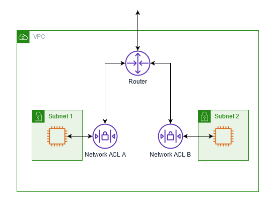
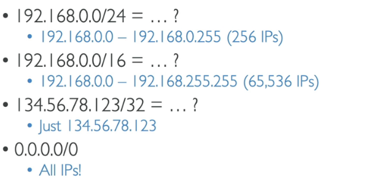
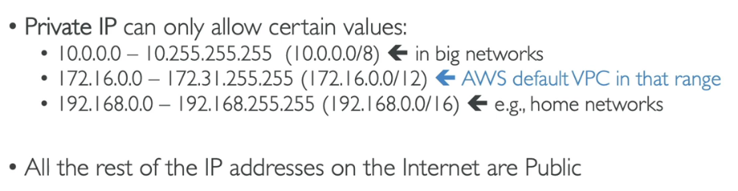
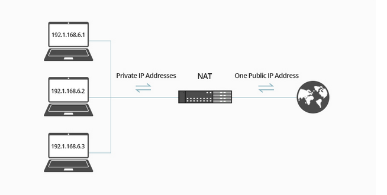
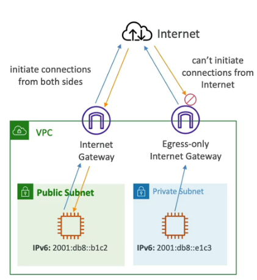
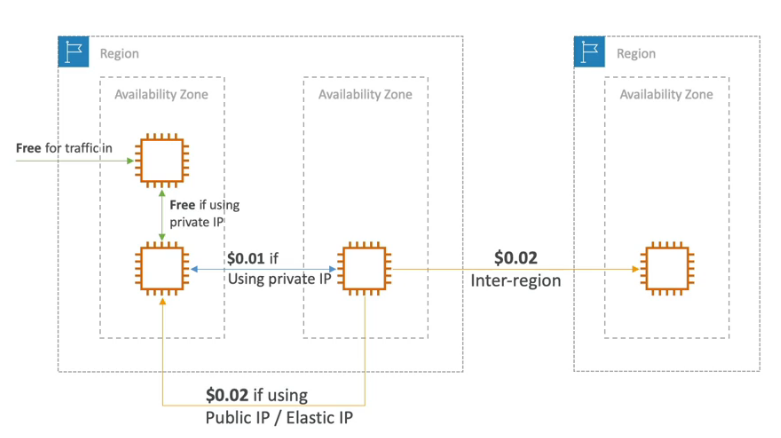
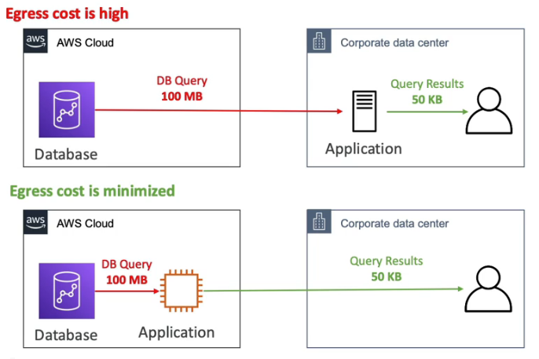
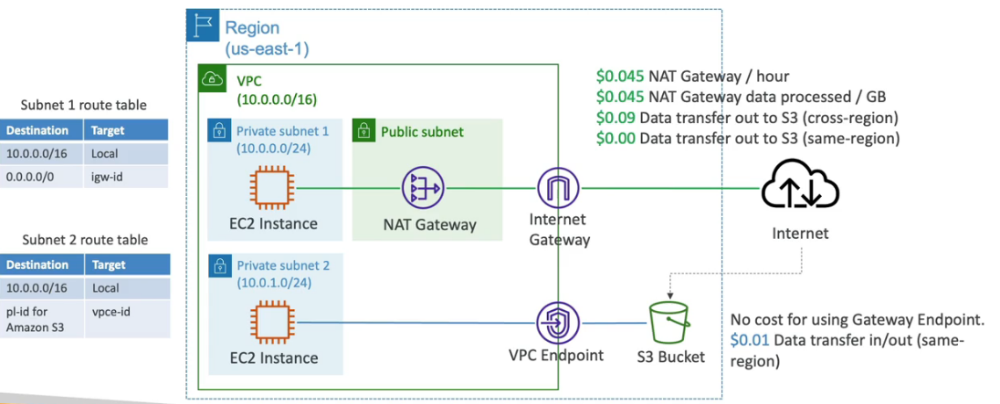

# AWS Network VPC

## AWS ACL - Network Access Control List
ACL allows or denies specific inbound or outbound traffic at the subnet level. 

### Pro
- No additional charge to use ACL.

---
 

## CIDR - Classless Inter Domain Routing
CIDR = IP Range
A subnet CIDR reservation is a range of IPv4 or IPv6 addresses that you set aside so that AWS can't assign them to your network interfaces. This enables you to reserve IPv4 or IPv6 CIDRs (also called "prefixes") for use with your network interfaces.

- AWS reserves 5 IP addresses in this range. They are used internally for networking and communication purposes within the AWS infrastructure.
- Helpful tool: <a href="https://www.ipaddressguide.com/cidr" target="_blank">https://www.ipaddressguide.com/cidr</a>

---
 

## Public & Private IP

---
 

## NAT - Network Address Translation
It's a way to map multiple private addresses inside a local network to a public IP address before transferring the information onto the internet.

---
 

## VPC Traffic Mirroring
Allows you to capture and inspect network traffic flowing through your Amazon Virtual Private Cloud (VPC). It can be used for various purposes, including monitoring and troubleshooting network traffic in real-time.

### Pro
- Monitor traffic between instances to detect and respond to potential security threats, such as intrusion attempts, malware infections, or unauthorized access.
- Capture and analyze network traffic during and after security incidents to investigate the root cause and impact of a breach or compromise.
- Monitor network performance and latency between instances to identify bottlenecks, optimize resource utilization, and ensure smooth application delivery.
- Capture and retain network traffic for compliance purposes, enabling audits and investigations to ensure adherence to industry regulations and internal policies.
- Decrypt SSL/TLS traffic for inspection by security appliances, ensuring that encrypted traffic is properly monitored for threats or compliance violations.

---
 

## IPv4 vs IPv6

- IPv4 was designed to provide 4.3 billion IP addresses, but we´re running to the end of 4.3 billion😅, therefore was IPv6 established.
- IPv6 is designed to provide 3.4x10x38 unique IP addresses. Every IPv6 is public, no private range.
- IPv4 cannot be disabled in VPC and subnets, you can just enable IPv6 and run in dual mode.
- Hint: Create a new CIDR Ipv4 in subnet.

---
 

## Egress-only Internet Gateway
Egress or exit only Internet Gateway opportunity example.

### Pro
- Egress-only Internet Gateway is not accessible from outside, only outbound traffic possible.
- When you wanna allow inbound traffic you need an second normal Internet Gateway.

Example, inbound with normal Internet Gateway, outbound with Egress-only Internet Gateway.

---
 

## Network Costs
Prices are per GB.

Be smart and minimize costs.

Another example.

---
 

## Solution Architect Summary 😍

- <b>NAT Instances: </b>Use NAT Instances when you need access to EC2 Instances in private subnets, BUT it is out of date, use NAT Gateway instead.

- <b>NAT Gateway: </b>Use NAT Instances when you need access to EC2 Instances in private subnets. Only works for IPv4.

- <b>ACL: </b>ACL allows or denies specific inbound or outbound traffic at the subnet level. Don´t forget ephemeral ports.

- <b>Egress-only Internet Gateway: </b>Use Egress-only Internet Gateway when you just send outbound traffic to the public internet, or split inbound and outbound Internet Gateways. For example for inbound use normal Internet Gateway and for outbound for special use cases use Egress-only Internet Gateway.

- <b>VPC Traffic Mirroring: </b>Use VPC Traffic Mirroring to copy network traffic from ENIs for further analysis for example with Athena.

- <b>CIDR: </b>CIDR = IP Range

- <b>Networking Costs: </b>Use private IP instead of public IP to communicate inside of a AZ and also better performance. Try to keep as much internet traffic within AWS. A lot of data transfer between on-premises and AWS Cloud can be very expensive.

