# AWS Connections

## EventBridge

Amazon EventBridge is a serverless event bus service that makes it easy to connect your applications with data from a variety of sources. EventBridge delivers a stream of real-time data from your own applications, software-as-a-service (SaaS) applications, and AWS services and routes that data to targets such as AWS Lambda. You can set up routing rules to determine where to send your data to build application architectures that react in real time to all of your data sources. EventBridge enables you to build event-driven architectures that are loosely coupled and distributed.

You almost endless possibilities with EventBridge, so you have to be creative to reach your requirements. 
Below are a few possibilities. 

## Use Cases
- Connection between applications (between AWS services).
- Event driven applications, event driven cloud flow.

A lot of possible architectures with EventBridge possible, here are just a few examples.

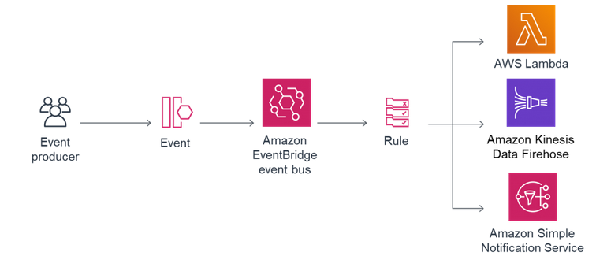

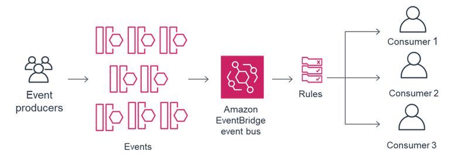

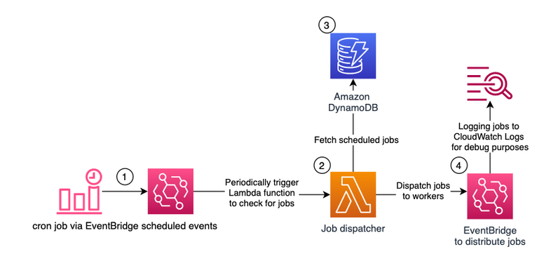

---
 

## VPC Endpoint PrivateLink
Private connection between VPC and AWS services like Aurora, DynamoDB etc. without traversing the public internet.

### Pro
- Private network instead of going to the public internet.
- Low latency.

### Contra or Attention
Two different types of endpoints available:
1. Interface Endpoint (PrivateLink): Connection to almost all AWS services possible, but it costs a lot.
2. Gateway Endpoint: This goes not over PrivateLink and supports S3 and DynamoDB, it is completely free of costs.

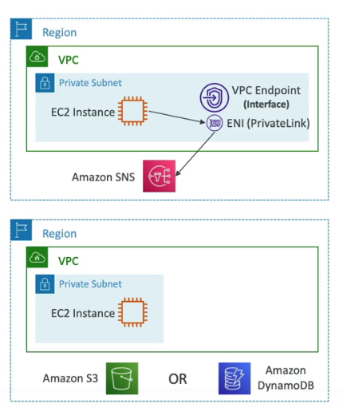

---
 

## VPC Peering
A VPC peering connection is a networking connection between two AWS VPCs that enables you to route traffic between them using private IPv4 addresses or IPv6 addresses.

### Pro
- Private connection between VPCs using AWS network.
- VPC Peering between own VPCs or VPCs in other accounts.
- VPCs can be in different regions.
- Never traverses the public internet.
- VPC peering provides a simple and cost-effective way to share resources between regions or replicate data for geographic redundancy.
- Must be established for each VPC.

## Contra
- AWS uses the existing infrastructure of a VPC to create a VPC peering connection; it is neither a gateway nor a VPN connection, and does not rely on a separate piece of physical hardware. There is no single point of failure for communication or a bandwidth bottleneck.

---
 

# Site2Site VPN
Connection between On-Premises servers or data centers and AWS Cloud VPC.
You have to enable "Route Propagation" in VPC. 
Add ICMP protocol on the inbound of security group.

- You are charged for each VPN connection hour that your VPN connection is provisioned and available.
- IPv6 traffic is not supported for VPN connections on a virtual private gateway.

1. ### Customer Gateway - VPN Gateway / public IP
Allows you to establish a VPN connection between on-premises servers and AWS Cloud VPC.
This connection using the public internet with a public IP address on Customer Gateway side.
1. Customer Gateway
2. VPN Gateway

---

2. ### Customer Gateway - NAT - VPN Gateway / private
Allows you to establish a VPN connection between on-premises servers and AWS Cloud VPC.
This connection using the public internet with a private IP address on Customer Gateway side, therefore we need NAT between.
1. Customer Gateway
2. VPN Gateway

---

3. ### AWS VPN CloudHub
Connection between multiple on-premises servers or data centers and AWS Cloud VPC.
1. Customer Gateway
2. Virtual Private Gateway (VGW)

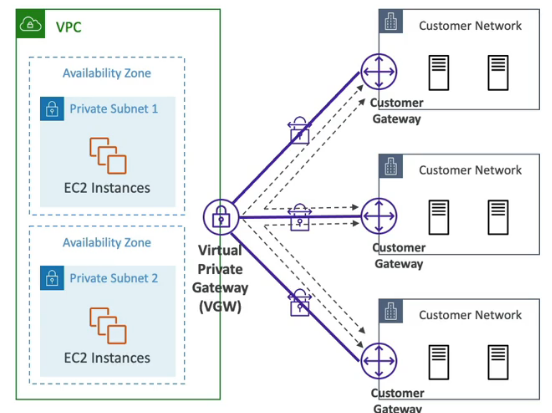

---

## Internet Gateway
An internet gateway is a horizontally scaled, redundant, and highly available VPC component that allows communication between your VPC and the internet.

### Pro
- VPC is able to communicate with the public internet.
- It supports IPv4 and IPv6 traffic.
- It does not cause availability risks or bandwidth constraints on your network traffic.
- Internet gateway also performs network address translation (NAT).

The following diagram shows the logic of internet gateway. If you have multiple AZ, connect an LoadBalancer to the Internet Gateway an the LoadBalancer routes the traffic to the services in the subnets.
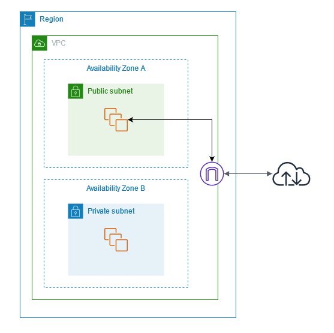

---
 

## Direct Connect
Absolute private connection between on-premises and AWS Cloud VPC via Customer Gateway -> AWS Direct Connect Location -> Virtual Private Gateway.

### Pro
- Private connection to on-premises.
- Also possible to route from Direct Connect Location directly into S3 or S3 Glacier.

### Contra
- Takes a lot of time to setup (longer than 1 month) because of WAN service providers etc.
- With Direct Connect you can only access one VPC in one region. For more you have to use an additional layer called Direct Connect Gateway.

### Connection Types
- Dedicated Connection: Fast connection. Request AWS first, the Direct Connect Partners.
- Hosted Connection: Slower. Request Direct Connect Partners.

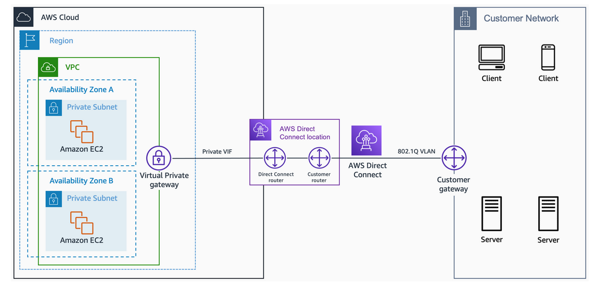

Integrating your AWS Direct Connect endpoint in an AWS Direct Connect location with your remote networks. <a href="https://aws.amazon.com/directconnect/partners/" target="_blank">https://aws.amazon.com/directconnect/partners/</a>

 

Consider Direct Connect Resiliency for critical workloads.
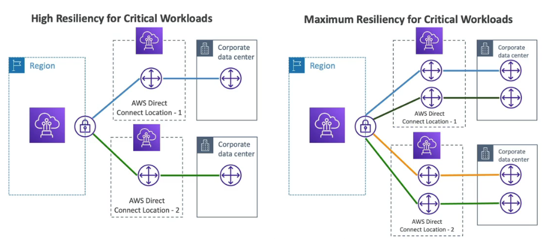 

---
 

## Direct Connect Gateway
Use Direct Connect Gateway to connect to one or more AWS VPC in many different regions. 
The same prozeder like in the Direct Connect diagram but with an additional layer between the regions.

### Pro
- Direct Connect to multiple regions and VPCs.
- Also absolutely private.

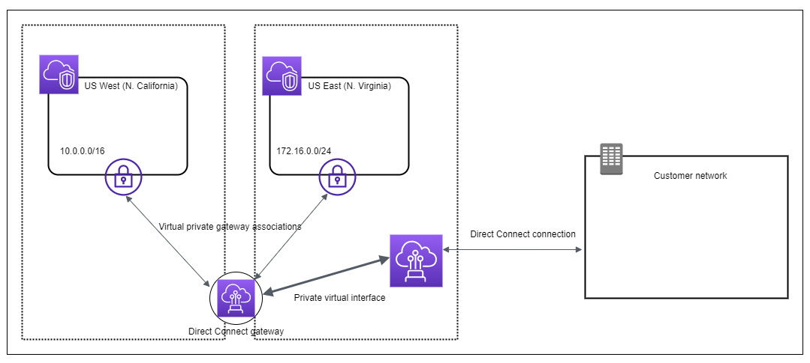

Direct Gateway can also be used to connect VPCs in different accounts.
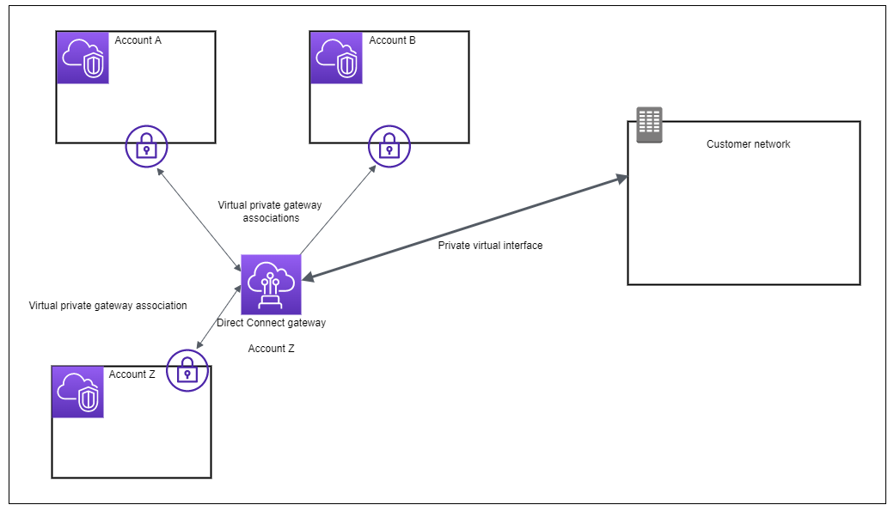

---
 

## Transit Gateway
As your cloud infrastructure expands globally, inter-Region peering connects transit gateways together using the AWS Global Infrastructure.

### Pro
- All network traffic between AWS data centers is automatically encrypted at the physical layer.
- IPv4 and IPv6 traffic is supported.
- Manage different routing domains (for example, production and non-production traffic) from a single point of management.
- Egress traffic through a NAT gateway or NAT instances.
- Global AWS backbone. Transit Gateways can be peered with each other within the same AWS Region or between different AWS Regions.

Diagram shows a multiple VPCs with multiple Transit Gateways architecture within AWS Cloud.
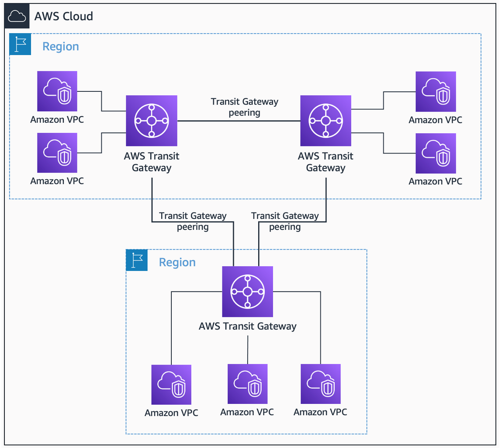

### Site2Site VPN Connection + Transit Gateway
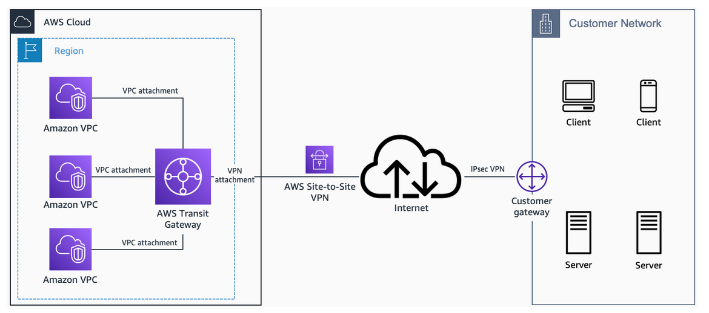

To prevent single point of failure and failover concerns, consider multi VPN connections.
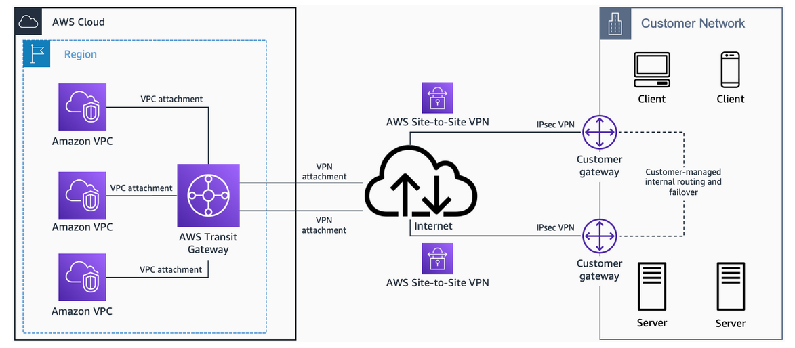

Another example to use Edge Location and a Global Accelerator to increase latency and performance. Keep in mind, this is very expensive. 😆
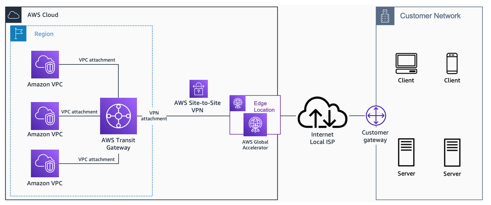

---
 

## NAT Gateway
Opportunity to make private subnet accessible from the internet.

- It works only from subnet to subnet, you can run NAT-Gateway from public subnet and route to private subnet.

---
 

## Bastian Host
Access via SSH to a private subnet.

### Pro
- Bastian Host is a EC2 Instance in a public subnet. Through the Bastian Host we get access to the application in the private subnet, private subnets are usually not accessible from outside, to maintain the application in the private subnet we need Bastian Host.
- Bastian Host must allow inbound traffic from the internet port 22, public CIDR.

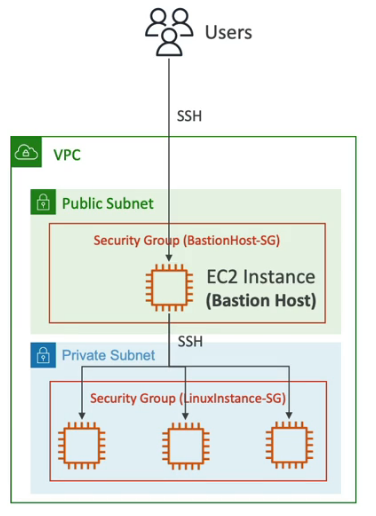

---
 

## Transit Gateway vs/+ Direct Connect Gateway

### Differences
- Transit Gateway: Centralized hub for connecting multiple VPCs and on-premises networks within a region, providing transitive routing.
- Transit Gateway: Ideal for simplifying VPC connectivity, supporting centralized management and communication between VPCs and on-premises networks.
- Direct Connect Gateway: Aggregates and manages multiple Direct Connect connections for private network connectivity between on-premises and multiple VPCs.
- Direct Connect Gateway: Suited for dedicated, low-latency connections between on-premises and multiple VPCs, especially across different regions.
### Together
AWS Direct Connect + AWS Transit Gateway, using transit VIF attachment to Direct Connect gateway, enables your network to connect up to six regional centralized routers over a private dedicated connection. The following diagram shows connecting to three routers. 
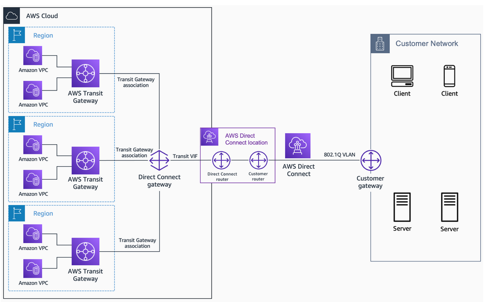

---
 

## Solution Architect Summary 😍

### On-Premises <-> VPC Connections

- <b>Site2Site VPN: </b>Setup Customer Gateway on on-premises Data Center, setup a Private Gateway on VPC and site-to-site VPN over public internet. 
Use AWS VPN CloudHub when you wanna connect multiple on-premises data centers or servers via Virtual Private Gateway (VGW) to AWS Cloud VPC.

- <b>Direct Connect: </b>In comparison to Site2Site you can use Direct Connect to establish a full private connection between on-premises to AWS Cloud VPC (Only ONE VPC) via AWS Direct Connect Location. Also a direct connection into S3 or S3 Glacier is possible.

- <b>Direct Connect + Direct Connect Gateway: </b>Use Direct Connect Gateway to connect to one or more AWS VPC in many different regions. Keep in mind that you have to connect on-premises to AWS Cloud VPC with Direct Connect first and then you can route to multiple VPCs and multiple account VPCs with Direct Connect Gateway.

- <b>Site2Site vs Direct Connect: </b>Site2Site is a connection over the public internet and higher latency, but faster to establish. 
Direct Connect is fully private connection with low latency, but takes time to setup.

---
 

### Connect services within VPC

- <b>VPC Peering: </b>Connect two VPCs. Not made to connect multiple VPCs, no overlapping CIDR. For failover consider multi peering connection.

- <b>VPC Endpoint/PrivateLink: </b>AWS PrivateLink you can use to privately connect your VPC to services as if they were in your VPC. You do not need to use an internet gateway, NAT device, public IP address, AWS Direct Connect connection, or AWS Site-to-Site VPN connection to allow communication with the service from your private subnets. Therefore, you control the specific API endpoints, sites, and services that are reachable from your VPC.

- <b>Transit Gateway: </b>Multiple peering connections for VPCs, VPNs and DX. Keep in mind you cant directly connect Direct Connect with Transit Gateway without Direct Connect Gateway (depends on your requirements).

---
 

### Internet access to private subnets

- <b>Bastian Host: </b>Use Bastian Host when you need SSH access to a private subnet.

- <b>NAT Instances: </b>NAT EC2 deployed on a public subnet to give internet access to an private subnet, but this is old use NAT Gateway.

- <b>NAT Gateway: </b>Managed service, provides internet access to private subnet. IPv4 only.

### Internet Gateway to your VPC

- <b>Internet Gateway: </b>Use Internet Gateway when you need Ipv4 and IPv6 internet access to you AWS Cloud VPC.

---
 

### Event driven connection to multiple services

- <b>EventBridge: </b>Use EventBridge in event driven architectures for example to trigger scaling of Lambda function triggered from CloudWatch. Keep in mind that you that you have a ton of possibilities with EventBus, just be creative and try it out.

---
 

### VS

- <b>Transit Gateway vs Direct Connect Gateway: </b>
AWS Transit Gateway is a hub-and-spoke network transit solution that simplifies connectivity between Amazon VPCs and on-premises networks. Used to connect multiple VPC from a Site2Site connection.
 
AWS Direct Connect Gateway is used to connect multiple Direct Connect locations to a single virtual private gateway, allowing you to extend on-premises networks into the AWS Cloud using dedicated network connections.

