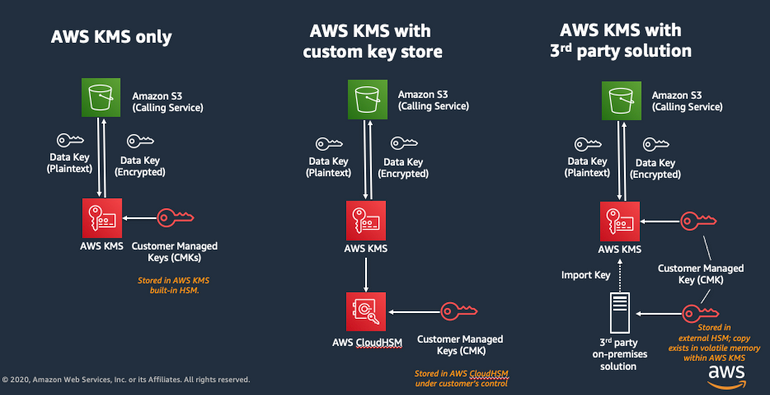
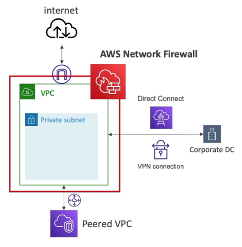

# AWS Security

## KMS - AWS Key Managements Service
AWS Key Management Service (AWS KMS) is an encryption and key management service scaled for the cloud. AWS KMS keys and functionality are used by other AWS services, and you can use them to protect data in your own applications that use AWS.

### Pro
- Encrypt and decrypt data via KMS API.
- Alias for keys possible.
- Encrypt/Decrypt data with terminal (aws command line), Serverless or with Nodejs, Java, Python etc.

Just use KMS only, very simple to use with an API call to encrypt or decrypt data.

---
 

## SSM - AWS Systems Manager Parameter Store
Hierarchical storage for configuration data management and secrets management. You can store data such as passwords, database strings, Amazon Machine Image (AMI) IDs, and license codes as parameter values.

### Pro
- Useable in EKS. Manage secrets in Kubernetes.
- Centralized way to manage configuration data.
- Parameter Store is integrated with SecretsManager.
- Accessible from Lambda, CloudFormation, CodePipelines, KMS, SNS, EKS, CloudWatch, EventBridge, CloudTrail etc. 
- You can configure change notifications and invoke automated actions for both parameters and parameter policies.
- Can store values as plain text or encrypted data.
- Can encrypt data, secrets with KMS.

### Contra
- No credential rotation possible.

---
 

## Secrets Manager
AWS Secrets Manager helps you manage, retrieve, and rotate database credentials, application credentials, OAuth tokens, API keys, and other secrets throughout their lifecycles. Many AWS services that use secrets store them in Secrets Manager.

### Pro
- You cannot store plain text values, only encrypted.
- Configure an automatic rotation schedule for secrets.
- For example, rotate all or specific secrets from EKS (Kubernetes) in a central way.
- Monitor secrets.
- Secrets are encrypted using KMS.
- Multi-Region secrets.

---
 

## ACM - AWS Certificate Manager
AWS Certificate Manager (ACM) helps you to provision, manage, and renew publicly trusted TLS certificates on AWS based websites.

### Pro
- Manage and automate rotate/renew TSL certificates HTTPS.
- In flight encryption for websites.
- Option to generate certificate outside of ACM and import it, but without automated rotate/renew functionality.

---
 

## WAF - AWS Web Application Firewall
Firewall for web applications. 

### Pro
- Protect services: CloudFront, Application Load Balancer, API Gateway, AppSync GraphQL APIs, Cognito user pool.
- Use WAF to inspect web requests for matches to conditions that you specify, such as the IP address that the requests originate from, the value of a specific request component, or the rate at which requests are being sent.
- Protection against: SQL Injection, Cross-Site Scripting (XSS), Cross-Site Request Forgery (CSRF), Application Layer DDoS Attacks, Bad Bots and Scrapers, HTTP Flood Attacks, Geographic Blocking, IP Blacklisting and Whitelisting, API Security, File Upload Security, Sensitive Data Exposure.

---
 

## Shield - AWS Shield
Specified protection against DDOS attacks.

### Pro
- All AWS customers benefit from the automatic protection of Shield Standard, at no additional charge. Shield Standard defends against the most common, frequently occurring network and transport layer DDoS attacks that target your website or applications.
- Protection against attacks on Layer 3/4/7 attacks.

### Contra
- Expanded DDoS attack protection for EC2 instances, Elastic Load Balancing load balancers, Amazon CloudFront distributions, and Amazon Route 53 hosted zones is very expensive.

---
 

## Firewall Manager - AWS Firewall Manager

### Pro
- AWS Firewall Manager is a security management service that allows you to centrally configure and manage firewall rules across your accounts and applications in AWS Organizations.

---
 

## GuardDuty - Amazon GuardDuty
AWS GuardDuty is a managed threat detection service that helps to protect AWS environment by continuously monitoring for malicious or unauthorized activities. 

### Pro
- It analyzes logs and events from various AWS data sources like CloudTrail, VPC Logs, DNS Logs and uses machine learning and anomaly detection to identify potential security threats.
- Unauthorized Access, Threat Detection, Suspicious Network Activity, Server Vulnerabilities etc.

---
 

## Inspector - AWS Inspector
Amazon Inspector is a security vulnerability assessment service that helps improve the security and compliance of your AWS resources.

### Pro
- Find security vulnerabilities in applications.
- Send findings to EventBridge.
- Scanner for EC2, Container Images push to ECR, Lambda functions.

---
 

## Macie - Amazon Macie
Amazon Macie helps protecting PII data. Macie is a fully managed data security and data privacy service that uses machine learning and pattern matching to discover and protect sensitive data in AWS.

### Pro
- Sensitive Data Discovery, Data Exposure and Access Patterns, Data Classification, Custom Data Identifiers, Data Retention and Deletion, Security Configuration Issues.
- Connection with CloudWatch possible, visualize Macies findings and operational metrics.

### More explanation
- It's important to note that the specific findings generated by Macie will depend on the data stored in your Amazon S3 buckets and the configuration settings you've defined. When Macie identifies potential risks or issues, it generates findings that provide detailed information about the findings' severity, impacted data, and recommendations for remediation. These findings help you prioritize and address security concerns within your data storage environment.

---
 

## AWS Network Firewall
Firewall for the entire AWS VPC.

### Pro
- Alert for traffic that matches rules what we set.
- Regex checking.
- Active flow inspection.

---
 

## AWS Cognito
Amazon Cognito handles user authentication and authorization for your web and mobile apps. With user pools, you can easily and securely add sign-up and sign-in functionality to your apps. With identity pools (federated identities), your apps can get temporary credentials that grant users access to specific AWS resources, whether the users are anonymous or are signed in.

### Pro
- Simple signUp ans signIn: username, password etc.
- Password reset.
- MFA
- Email or SMS verification.
- Federated Identities: Facebook, Google etc.

---
 

## Solution Architect Summary 😍

- <b>KMS: </b>Use AWS KMS when you need a dedicated service to create, manage, and control access to cryptographic keys for encryption and decryption of data across various AWS services.

- <b>SSM : </b>Use AWS Systems Manager Parameter Store when you need a centralized and secure storage solution for managing configuration data, secrets, and sensitive information, accessible by applications and services in a controlled manner.

- <b>Secrets Manager : </b>Use AWS Secrets Manager when you require a specialized service to securely manage, <strong>rotate</strong>, and automate the encryption and lifecycle of sensitive secrets, such as database passwords and API keys.

- <b>ACM: </b>Use AWS Certificate Manager when you need HTTPS encryption on your AWS based websites.

- <b>WAF: </b> Use WAF when you need a firewall in front of your application to protect against common attacks for example to use rate limiter in API Gateway to protect against DDOS attacks to Lambda function etc.

- <b>Shield: </b>AWS Shield is automatically enabled for all services, but if you need expanded DDOS protection for EC2, Elastic Load Balancer, CloudFront, Global Accelerator and Route53 use Shield Advanced you will have 24/7 DDOS response team etc.

- <b>Firewall Manager: </b>Use AWS Firewall Manager in case you have a Organization to manage WAF rules, Shield Advanced rules, security groups, AWS Network Firewall rules, Route53 - DNS firewall rules in one place.

- <b>GuardDuty: </b>Use Amazon GuardDuty if you wanna analyze AWS Cloud environment (CloudTrails, VPC Logs, DNS Logs) using machine learning to find suspicious actions and let you inform/warn via email or notifications. When you wanna trigger an alarm if something is weird, you have to create CloudWatch event rule which triggers SNS topic. Increases the security level of your AWS account. GuardDuty is a security analyze tool on AWS Cloud environment (Account, Organization) level.

- <b>Inspector: </b>Use AWS Inspector if you need an security scanner for EC2 Instances, Container Images (ECR) or Lambda functions and let you inform via email or notification. Inspector is a security scanning tool in application level. GuardDuty for your account, Inspector for your applications.

- <b>Macie: </b>Use AWS Macie if you wanna find PII (Personally Identifiable Information) etc. By connecting Macie with CloudWatch, you can enhance your ability to monitor, analyze, and respond to security events and findings related to sensitive data stored in Amazon S3. It enables you to proactively manage your data security posture and take timely actions to mitigate risks.

- <b>AWS Network Firewall: </b>Use AWS Network Firewall when you need a firewall on VPC level.

- <b>Cognito: </b>Use AWS Cognito for user authentication an authorization for web and apps.

- <b>CloudHSM: </b>AWS CloudHSM (Hardware Security Module) is a service that provides dedicated hardware for cryptographic key management, offering enhanced security and compliance for sensitive data and applications requiring strong encryption.

- <b>WAF vs Shield: </b> AWS WAF: AWS Web Application Firewall (WAF) is a service that helps protect web applications from various web exploits and attacks by allowing you to create custom rules to filter and monitor incoming traffic. 
AWS Shield: AWS Shield is a managed Distributed Denial of Service (DDoS) protection service that safeguards applications against large-scale, network and transport layer DDoS attacks by automatically detecting and mitigating them.
