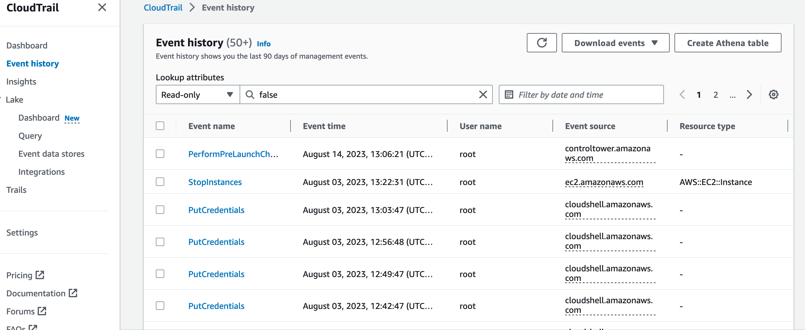

# AWS Monitoring

## CloudWatch
It helps you collect, monitor, and analyze data from your applications, infrastructure, and services to gain insights, troubleshoot issues, and ensure optimal performance

### Pro
- Collect and monitoring application performance etc.
- Set alarms and notifications based on thresholds/utilization.
- Integrate CloudWatch with Auto Scaling to dynamically adjust the number of instances in response to changes in demand, ensuring optimal resource utilization.
- Monitor log analytics.
- Monitor EKS container insights.
- Automate actions by using CloudWatch Events to respond to scheduled events or time-based triggers.
- Possibility to connect CloudWatch with CloudTrail.
- A lot more...

---
 

## CloudTrail
CloudTrail tracks EVERY API call in AWS account by everyone.

### Pro
- Can track every action to track user actions, for example somebody terminated a service, you can see it in CloudTrail.
- CloudTrail is free.

Go to CloudTrail an see your recent events.

---
 

## AWS Config
AWS Config automatically evaluates the recorded configurations against the configuration you specify.

### Pro
- It is like a software unit test, I would recommend a test-driven development in AWS configuration with the aid on AWS Config. Specify the configuration in AWS Config for example that the LoadBalancer is assigned to an SSL certificate. Then create the Load Balancer with SSL config. AWS Config will evaluate your config.
- Let you send emails if any configuration in wrong.

---
 

## Solution Architect Summary 😍

- <b>CloudWatch: </b>Use CloudWatch for real-time monitoring and alerting of performance metrics to ensure optimal application and resource health.

- <b>CloudWatch Agent: </b>CloudWatch agent enables you to collect internal system-level metrics from Amazon EC2 instances across operating systems. The metrics can include in-guest metrics, in addition to the metrics for EC2 instances.

- <b>CloudTrail: </b>Use CloudTrail to track and audit API activity of everything in your AWS account (creation of EC2 Instance, deletion of Container etc.) to maintain accountability, governance, and compliance. You can create a CloudTrail trail in the management account with the organization trails option enabled and this will create the trail in all AWS accounts within the organization.

- <b>Config: </b>Use AWS Config for continuous configuration monitoring and assessment of resource compliance to enforce desired configurations and detect changes. Use it like a unit test for your configurations.
