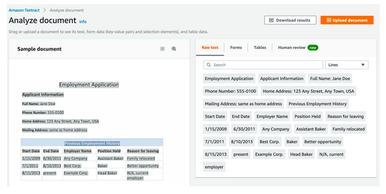

# AWS Machine Learning

## Solution Architect Summary 😍

- <b>AWS SageMaker: </b>AWS SageMaker is a fully managed machine learning service that enables you to build, train, and deploy machine learning models at scale, making it ideal for developing and operationalizing machine learning applications and algorithms.

- <b>AWS Translate: </b>AWS Translate is a neural machine translation service that enables you to easily and accurately translate text between languages, making it useful for localizing content, supporting multilingual communication, and analyzing text in different languages. Use Translate API to translate your web content on website or app.

- <b>AWS Polly: </b>AWS Polly is a text-to-speech service that converts text into lifelike speech, making it useful for creating voice-enabled applications, automated voice responses, and audio content generation.

- <b>AWS Transcribe: </b>Speech-to-text service that converts spoken language into written text.

- <b>AWS Rekognition: </b>AWS Rekognition is a deep learning-based image and video analysis service that detects objects, faces, text, and scenes, making it suitable for building applications that require image and video analysis, content moderation, and facial recognition capabilities.

- <b>AWS Textract: </b>AWS Textract is a fully managed service that automatically extracts text and structured data from scanned documents, forms, and images, making it valuable for automating document processing, data extraction, and content indexing.

- <b>AWS Personalize: </b>AWS Personalize is a machine learning service that creates personalized recommendations for users, enabling you to deliver tailored product and content recommendations in applications, e-commerce platforms, and content streaming services.

- <b>AWS Kendra: </b>AWS Kendra is an intelligent search service that uses machine learning to provide more accurate and contextual search results across various data sources, making it valuable for enhancing enterprise search and information retrieval in large datasets. Learn from data sources like pdf, text, HTML, PowerPoint, MS Word.

- <b>AWS Forecast: </b>AWS Forecast is a machine learning service that generates accurate forecasts for time-series data, making it suitable for predicting future trends, demand, and resource allocation in various industries such as retail, finance, and supply chain management.

- <b>AWS Comprehend: </b>AWS Comprehend is a natural language processing (NLP) service that extracts insights and meaning from text, making it useful for analyzing sentiment, key phrases, entities, and language syntax in customer interactions, social media, and content analysis. Can understand what in the language of the text or how positive or negative is the text etc.

- <b>AWS Comprehend Medical: </b>AWS Comprehend Medical is a specialized natural language processing (NLP) service that extracts medical information and insights from unstructured clinical text, making it valuable for healthcare and life sciences applications such as medical record analysis, clinical trial matching, and medical coding.

- <b>AWS Lex & Connect: </b>Same technology that powers Alexa. For call center or chat bots. AWS Lex is a service for building conversational interfaces (chatbots) using natural language understanding and processing, while AWS Connect is a cloud-based contact center service, and both can be used to enhance customer interactions and support in applications, websites, and call centers.
