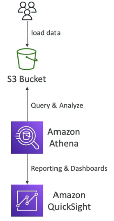

# AWS Data Analytics

## Kinesis Data Analytics
Amazon Kinesis makes it easy to collect, process, and analyze video and data streams in real time.

### Pro & Use Cases
- Process and analyze real-time streaming data using SQL-like queries.
- Monitor financial market data and perform real-time analysis for trading strategies, risk assessment, and regulatory compliance.

---
 

## Athena
Serverless query service to analyze data stored in S3.

### Pro
- Use larger files, Athena is best practice for that to minimize overhead > 128mb
- Athena Federated Query allows you to run SQL queries across relational and npn-relational databases.
- Do columnar data scanning to save costs, analyze only the columns what do you need to analyze.
- Recommended formats for performance is Parquet or ORC. Use AWS Glue to convert data to Parquet or ORC.

---
 

## Redshift

- Very high performance data warehouse.
- Redshift has faster queries, joins and aggregation.
- Columnar storage if data.
- Multi AZ.
- Snapshots in S3.
- Automatically copy snapshots to other regions.

---
 

## Solution Architect Summary 😍

- <b>Kinesis Data Analytics: </b>Amazon Kinesis Data Analytics is a managed service that lets you analyze real-time streaming data using SQL-like queries, suitable for gaining insights, detecting patterns, and making timely decisions from dynamic data sources.

- <b>Athena: </b>Amazon Athena is a serverless query service that allows you to analyze data stored in Amazon S3 using standard SQL, making it ideal for ad-hoc querying and analysis of large datasets without the need for infrastructure provisioning. Use Parquet or ORC, use AWS Glue to convert data to this formats.

- <b>Kinesis Data Analytics vs Athena: </b>Kinesis Data Analytics is used for real-time analysis of streaming data, while Athena is for on-demand querying of data stored in Amazon S3, making Athena suitable for historical analysis and ad-hoc querying of static datasets.

- <b>AWS Redshift: </b>Amazon Redshift is a fully managed data warehousing service that allows you to analyze large volumes of data using standard SQL queries, making it suitable for data warehousing, business intelligence, and complex analytics scenarios.

- <b>Redshift vs Kinesis Analytics vs Athena: </b>Amazon Redshift is a data warehousing service for analyzing large datasets with SQL; Kinesis Data Analytics processes real-time streaming data; and Athena enables ad-hoc querying of data stored in Amazon S3, catering to different data analysis needs and use cases.

- <b>Kinesis Data Firehose: </b>Amazon Kinesis Data Firehose is a fully managed service for delivering real-time streaming data to destinations such as Amazon Simple Storage Service (Amazon S3), Amazon Redshift, Amazon OpenSearch Service, Amazon OpenSearch Serverless, Splunk, and any custom HTTP endpoint or HTTP endpoints owned by supported third-party service providers, including Datadog, Dynatrace, LogicMonitor, MongoDB, New Relic, Coralogix, and Elastic. Kinesis Data Stream -> Kinesis Firehose and Kinesis Analytics analyze real time data. 

- <b>OpenSearch ex. ElasticSearch: </b>AWS OpenSearch is a fully managed, open-source search and analytics engine that enables you to explore and analyze data in real time, making it ideal for building applications that require advanced search capabilities and real-time data insights.

- <b>AWS Glue: </b>AWS Glue is a scalable, serverless data integration service that makes it easy to discover, prepare, and combine data for analytics, machine learning, and application development.

- <b>QuickSight: </b>AWS QuickSight is a cloud-based business intelligence (BI) service that enables users to create interactive visualizations and dashboards from various data sources, making it ideal for data analysis, reporting, and data-driven decision-making. Perform ad hoc analysis, and quickly get business insights from your data.

- <b>EMR Hadoop: </b>AWS EMR (Elastic MapReduce) is a managed big data platform that simplifies the deployment and scaling of Apache Hadoop and related big data frameworks, making it suitable for processing and analyzing large datasets using distributed computing techniques.

- <b>Redshift vs EMR Hadoop: </b>Amazon Redshift is a fully managed data warehousing service optimized for analytics and complex querying, while Amazon EMR is a managed big data platform for processing and analyzing large datasets using distributed frameworks like Apache Hadoop and Spark.

- <b>Lake Formation: </b>AWS Lake Formation is a service that simplifies the process of building, securing, and managing a data lake, enabling you to store and analyze vast amounts of structured and unstructured data from various sources.

- <b>AWS MSK: </b>AWS MSK (Managed Streaming for Apache Kafka) is a fully managed service that makes it easy to build and run applications that use Apache Kafka for real-time data streaming and event processing.