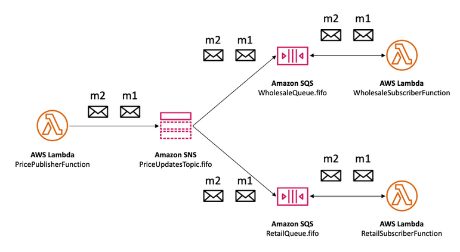

# AWS Messaging

## SQS - Simple Queue Service
SQS is a fully managed message queuing service that makes it easy to decouple and scale microservices, distributed systems, and serverless applications. SQS moves data between distributed application components and helps you decouple these components.

### Pro
- In flight encryption.
- At rest encrypted with KMS.
- Long polling for both SQS and SQS FIFO available. Long polling can be beneficial in scenarios where you want to reduce the number of empty responses and achieve cost savings. Long polling for fewer latency and costs.
- Both SQS and SQS FIFO can be used with AutoScalingGroup.
- Data being deleted after consumed.
- Can have multiple consumers as we want.

### Use Cases
- Asynchronous communication between microservices.
- SQS is suitable for cases where message order is not a strict requirement.

### Example

---
 

## SQS FIFO
SQS FIFO is the same like SQS but with a strict ordered structure of messages First-in-First-out system.

### Use Cases
- Financial systems.
- Order processing e-commerce.
- Message ordering with only one consumer.

### Examples

Simple

 

Advanced

 

Real life

---
 

## SNS - Simple Notification Service
Amazon SNS (Simple Notification Service) is a fully managed publish-subscribe messaging service that delivers messages to multiple recipients or subscribers.

### Pro
- Publish - Subscribe technique.

### Use Cases
- Send instant notifications to administrators or operations teams about system health, performance, or error conditions.
- Distribute events or updates to multiple services or microservices in a loosely coupled architecture, promoting modularity and scalability.
- Implement fanout patterns, where a single message is sent to SNS and then forwarded to multiple endpoints, such as email, SMS, and AWS Lambda functions.

---
 

## SQS + SNS
SNS can send messaged to multiple subscribers and SQS is a reliable message delivery service. In some use cases you can combine both services to achieve your requirements.

### Use Cases
- SNS + SQS Fan out.
- Also good opportunity for a cross region architecture.

---
 

## Kinesis Data Stream
You can use Amazon Kinesis Data Streams to collect and process large streams of data records in real time.

### Pro
- Real time.
- Send data directly to Kinesis Analytics to analyze data in real time.
- Data stream for large amount of data.
- Data is put into Kinesis data streams, which ensures durability and elasticity. The delay between the time a record is put into the stream and the time it can be retrieved (put-to-get delay) is typically less than 1 second.
- Provisioned mode: scale manually.
- On-demand mode: Scale automatically, more expensive than provisioned.
- Encrypted at rest.
- Shard model to process messages. Ordered messages like SQS FIFO.
- Data expires after X days.

---
 

## MQ
MQ is a managed message broker service that makes it easy to set up and operate message brokers in the cloud. Amazon MQ provides interoperability with your existing applications and services. Amazon MQ works with your existing applications and services without the need to manage, operate, or maintain your own messaging system.

### Pro & Use Cases
- Message Broker.
- Supports MQTT, AMQP, STOMP, Openwire, WSS
- MQTT is a lightweight and efficient protocol specifically designed for communication between devices in scenarios like Internet of Things (IoT).
- MQTT connection to vehicles.

---
 

## Solution Architect Summary 😍

- <b>SQS: </b>Use SQS when you need a reliable and scalable messaging system that provides asynchronous communication between different components (microservices) of your application and where is strict message ordering not important.

- <b>SQS FIFO: </b>Use SQS FIFO when your application requires strict ordering of messages. SQS FIFO is designed to ensure that messages are processed exactly in the order they were sent, making it appropriate for scenarios such as financial transactions, order processing, or any situation where maintaining the exact sequence of events is crucial. No data loss.

- <b>SNS: </b>Use SNS when you need to broadcast messages to multiple subscribers, such as notifications, alerts, or updates, allowing decoupled communication without requiring subscribers to explicitly interact with each other. Danger of data loss, data are not persisted if not delivered. Pub/Sub technique.

- <b>SQS vs SNS: </b>SQS is more suitable for point-to-point communication between components with a focus on reliable message delivery, SNS excels in broadcasting messages to multiple subscribers across various communication channels, making it ideal for notification and event distribution scenarios. One message for many receivers.

- <b>Kinesis Data Stream: </b>Kinesis Data Streams is a scalable and real-time data streaming service that ingests and processes high volumes of data, enabling real-time analytics and insights in combination with Kinesis Analytics.

- <b>MQ: </b>Use AWS MQ when you need a managed message broker that supports industry-standard protocols like MQTT, AMQP, and others for seamless communication between applications, services, IoT-Devices and Vehicles.

- <b></b>

- <b>SNS Publish: </b>

