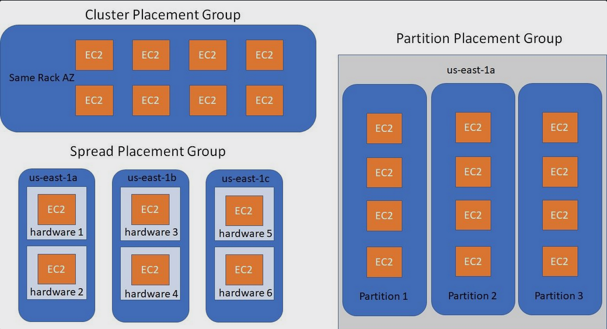

# AWS Another Services

## Solution Architect Summary 😍

- <b>AWS Private 5G: </b>AWS Private 5G is a solution that enables organizations to build and operate their own private 5G networks, providing dedicated wireless connectivity for applications and devices within a controlled environment.

- <b>AWS Wavelength: </b>AWS Wavelength is an infrastructure service that brings AWS compute and storage services to the edge of 5G networks, reducing latency for applications that require real-time and high-speed interactions with devices.

- <b>AWS License Manager: </b>AWS License Manager is a service that helps you manage, discover, and enforce software licenses, enabling efficient tracking of licenses and ensuring compliance across your AWS resources and applications.

- <b>AWS AppSync: </b>AWS AppSync is a managed service that enables developers to create GraphQL APIs for building scalable, real-time applications by simplifying data synchronization and interaction with various data sources.

- <b>AWS OpsWorks: </b>AWS OpsWorks is a configuration management service provided by Amazon Web Services that allows you to automate the deployment, management, and scaling of applications using predefined templates or custom configurations, making it easier to maintain infrastructure as code and ensure consistency across your environment.

- <b>CloudFormation vs OpsWorks: </b>OpsWorks  focuses on application deployment and management with predefined layers. CloudFormation is a more general-purpose service for provisioning and managing a wide range of AWS resources using templates.

- <b>Step Functions: </b>AWS Step Functions makes it easy to coordinate the components of distributed applications as a series of steps in a visual workflow. You can quickly build and run state machines to execute the steps of your application in a reliable and scalable fashion. Microservices Coordination: Coordinating interactions between different microservices within a larger application to ensure correct execution order and error handling. Serverless Applications: Managing serverless functions and services by defining workflows that orchestrate the execution of different functions based on events or conditions.

- <b>Placement Groups: </b>AWS Placement Groups are logical groupings that enable control over the physical location of Amazon EC2 instances, optimizing network performance and availability based on workload requirements.

- <b>AWS Data Exchange: </b>AWS Data Exchange makes it easy for AWS customers to securely exchange and use third-party data on AWS.

- <b>AWS Budget: </b>AWS Budgets is a service provided by Amazon Web Services that allows you to set up and manage budgets for your AWS resources and services. With AWS Budgets, you can define spending limits and receive notifications when your usage or costs exceed the thresholds you've set, helping you track, monitor, and control your AWS spending. It's a valuable tool for cost management and ensuring that your AWS usage aligns with your financial goals.