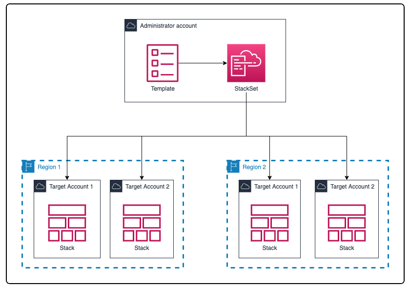

# Convenient Things

## CloudFormation
AWS CloudFormation enables you to create and provision AWS infrastructure deployments predictably and repeatedly. It helps you leverage AWS products such as Amazon EC2, Amazon Elastic Block Store, Amazon SNS, Elastic Load Balancing, and Auto Scaling to build highly reliable, highly scalable, cost-effective applications in the cloud without worrying about creating and configuring the underlying AWS infrastructure. AWS CloudFormation enables you to use a template file to create and delete a collection of resources together as a single unit (a stack).

### Pro
- No resources are manually created what is good to prevent mistakes.
- Changes are reviewed.
- Easily estimate costs using CloudFormation template.
- Saving strategy: Automate to hibernate EC2 for example over night and restart automatically in the morning etc.
- Ability to destroy and re-create infrastructure on the cloud on the fly.
- CloudFormation starts all services in a ordered way.
- CloudFormation automatically creates a diagram of your infrastructure, you can see all services and their relations.
- Easy to replicate your entire infrastructure to other accounts for example when you have an dev and prod account you can easily replicate it with CloudFormation yaml file. Take the yaml file and replicate it everywhere.
- Multi region deployment possible.
- You can always do updates. CloudFormation will give you an overview about the changes and updates everything include the diagram documentation.

CloudFormation will give you a diagram like this.

Example of an very easy CloudFormation yaml file to start EC2 Instance with security groups and enabled SSH port.

Multi region and multi account creation with CloudFormation.

### More
This is your main tool in AWS.

---
 

## API Gateway
Amazon API Gateway is an AWS service for creating, publishing, maintaining, monitoring, and securing REST, HTTP, and WebSocket APIs at any scale. 

### Pro
- Handles API versioning v1, v2
- Handles different environments (dev, prod)
- Handles API security (Authentication, Authorization)
- Creates API keys, handle request throttling
- Swagger automatically implemented
- Cache API responses
- Use it with Lambda

---
 

## SES - AWS Simple Email Service
Amazon Simple Email Service (Amazon SES) is a cloud-based email sending and receiving service provided by Amazon Web Services (AWS). It enables you to send transactional, promotional, and marketing emails to your customers, subscribers, or users. Additionally, you can also use Amazon SES to receive and process incoming email.

### Pro
- Send bulk emails, also in code.
- Send single email, also in code.
- High Deliverability.
- Dedicated IP Addresses.
- Email templates.
- Statistics and Metrics.
- Ability to send email, not only receive.
- Scalable
- Email templates.

### Use Cases
- Order confirmation emails.
- Password change emails.
- Marketing campaigns.
- Notifications, alerts, and other communication needs.

---
 

## AWS Pinpoint
Send emails, SMSs, voice messages and push notifications. You can use Amazon Pinpoint to send targeted messages (such as promotions and retention campaigns), as well as transactional messages (such as order confirmations and password reset messages).

### Pro
- Main use cases are send SMS, push messages, voice, in app messaging.
- Scalable.
- Bulk possible.
- Delivery schedule.
- Message templates.

---
 

## SSM - SSM Session Manager
Start a secure shell on your EC2 and on-premises servers.

### Pro
- No SSH, bastian hosts or SHH keys needed.
- Port 22 SSH in not open, better security.
- SSM Agent on EC2 is connected to Session Manager.
- Supports Linux, Mac, Windows.
- Sends session log data
- Run commands.
- Patch manager.

---
 

## Cost Explorer

### Pro
- Visualized and understand AWS costs.
- Create reports and analyze costs.
- Choose an optimal saving plan.
- Forecast usage up to 12 month based on previous usage.
- Saving plan alternative to reserved instances.

---
 

## AWS Elastic Transcoder
Convert media files stored in S3 into media files in the required format (phones etc.)

### Pro
- Duration based pricing model.
- Easy to use.

---
 

## AWS Batch
Service to execute batch jobs.

### Pro
- Scalable.
- Starts EC2 or Spot Instances dynamically.
- Batch jobs scheduled with start and end.

---
 

## AWS AppFlow 
Amazon AppFlow is a fully managed API integration service that you use to connect your software as a service (SaaS) applications to AWS services, and securely transfer data. Use Amazon AppFlow flows to manage and automate your data transfers without needing to write code.

### Pro
- Shift data from cloud services like Salesforce to AWS Cloud, or from AWS Cloud to Salesforce for example.

---
 

## Well-Architected Framework

### Pro
- General guiding principles.
- Stop guessing your capacity needs.
- Test system at production scale.
- Automate things to make experimentation easier.
- Improve through game days, simulate applications.

### 6 Pillars
1. Operational Excellence
2. Security
3. Reliability
4. Performance Efficiency
5. Cost Optimization
6. Sustainability

<a href="https://aws.amazon.com/architecture/well-architected/?wa-lens-whitepapers.sort-by=item.additionalFields.sortDate&wa-lens-whitepapers.sort-order=desc&wa-guidance-whitepapers.sort-by=item.additionalFields.sortDate&wa-guidance-whitepapers.sort-order=desc" target="_blank">https://aws.amazon.com/architecture/well-architected/?wa-lens-whitepapers.sort-by=item.additionalFields.sortDate&wa-lens-whitepapers.sort-order=desc&wa-guidance-whitepapers.sort-by=item.additionalFields.sortDate&wa-guidance-whitepapers.sort-order=desc</a>

### AWS Well Architected Framework Tool

<a href="https://console.aws.amazon.com/wellarchitected" target="_blank">https://console.aws.amazon.com/wellarchitected</a> 

---
 

## Trusted Advisor
Hight level account assessment, like unit tests for your architecture.

- Cost optimization
- Performance
- Security
- Fault tolerance
- Service limits

Still ToDo

---
 

## Solution Architect Summary 😍

- <b>CloudFormation: </b>Use AWS CloudFormation to provision and manage infrastructure as code, ensuring consistent and repeatable deployments of resources and applications. CloudFormation creates all resources for you with the aid of an from you created or from AWS pre-created yaml file, its reliable and cost effective. Fully managed services like Beanstalk also using CloudFormation in the background. Never create AWS services manually, do it with CloudFormation.

- <b>API Gateway: </b>Use API Gateway to secure and managing you APIs for example in front of Lambda functions.

- <b>SES: </b>Use AWS Simple Email Service to send emails reliable for password resets, confirmations etc.

- <b>Pinpoint: </b>Use pinpoint to send emails, sms, push notifications, voice messaging reliable in scalable way.

- <b>SSM: </b>Use Session Manager for a super secure shell instead of SSH keys etc.

- <b>Cost Explorer: </b>Use Cost Explorer to control and estimate costs. Create save plans.

- <b>AWS Elastic Transcoder: </b>Use Elastic Transcoder to convert media files into the right format for different devices for example smartphones, tablets etc.

- <b>AWS Batch</b>Use AWS Batch for fully managed batch jobs.

- <b>AppFlow: </b>Use AWS AppFlow to shift data from cloud services like Salesforce to AWS Cloud, or from AWS Cloud to Salesforce for example.

- <b>Well-Architected Framework: </b>Use AWS Well-Architected Framework to review your architecture and improve.

- <b>AWS Compute Optimizer: </b>AWS Compute Optimizer helps you identify the optimal AWS resource configurations, such as Amazon Elastic Compute Cloud (EC2) instance types, Amazon Elastic Block Store (EBS) volume configurations, and AWS Lambda function memory sizes, using machine learning to analyze historical utilization metrics. AWS Compute Optimizer provides a set of APIs and a console experience to help you reduce costs and increase workload performance by recommending the optimal AWS resources for your AWS workloads.

- <b>AWS Trusted Advisor: </b>Trusted Advisor inspects your AWS environment, and then makes recommendations when opportunities exist to save money, improve system availability and performance, or help close security gaps.

- <b>Compute Optimizer vs Trusted Advisor: </b>AWS Compute Optimizer analyzes resource utilization patterns and recommends optimal instance types, while Trusted Advisor offers broader recommendations for optimizing AWS resources, including cost, performance, security, and fault tolerance.

- <b>AWS Cost Explorer vs AWS Trusted Advisor vs AWS Compute Optimizer: </b> 
AWS Cost Explorer: Use it to visualize, understand, and manage your AWS costs and usage patterns. 
AWS Trusted Advisor: Use it to get real-time guidance on optimizing your AWS infrastructure and resources for cost, performance, security, and fault tolerance. 
AWS Compute Optimizer: Use it to analyze the utilization and performance of your Amazon EC2 instances and Auto Scaling groups, and receive recommendations to optimize their configurations for better performance and cost efficiency.

